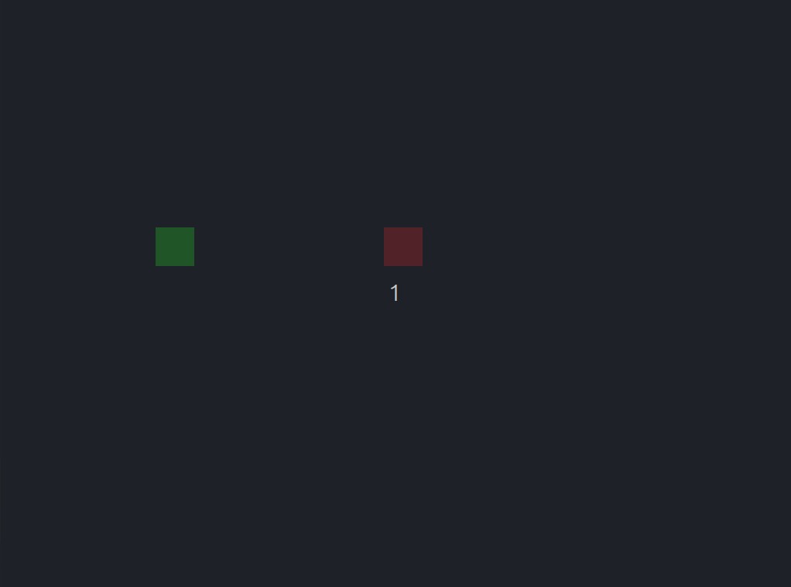

# Enemy AI
Small example of using Lua script for giving game objects some inteligence.



# About
You can play with `WASD` the green rectangle and it can flee from red rectangle. You can also make changes in the enemy_ai.lua script during the gameplay and hit `R` button to reload the script.
   

# What you can learn here?
This repository is used in an article on my blog, [Lua for Dynamic AI in Games
](https://lucasklassmann.com/blog/2025-01-27-lua-dynamic-ai-in-games/), 
in that article I explain in detail how some features from Lua were used in which case.

## Dependencies

- [CMake >= 2.8.12](https://cmake.org/download/)
- [Lua 5.3](https://www.lua.org/download.html)
- [SDL 2](https://www.libsdl.org/)

Installation depends on the platform, in Ubuntu Linux:
```
sudo apt install libsdl2-dev libsdl2-ttf-dev libsdl2-image-dev libsdl2-mixer-dev liblua5.3-dev lua5.3 cmake
```

# License
[Apache 2.0](LICENSE)